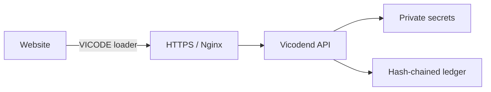

# Vicodend

[](LICENSE)
[](package.json)
[](https://github.com/Vietflexmap/Vicodend/actions/workflows/test.yml)

**Vicodend** is the official backend for **VICODE**, developed by Long Ngo and released under the MIT License. The naming convention is fixed throughout this repository:

- Product and browser API: **VICODE**
- VPS backend and GitHub repository: **Vicodend**
- Browser distribution file: `vicode.min.js`
- Linux service: `vicodend.service`

Vicodend keeps credentials, personal information, payment secrets and business rules on a self-hosted VPS. The public VICODE loader obtains a short-lived, origin-bound token and communicates with the backend over HTTPS.

> Vicodend is tamper-evident, not “absolutely secure.” JavaScript delivered to a browser can be inspected. Its append-only hash chain detects ledger modification but is not a decentralized blockchain. Never put passwords, API secrets, private keys or payment credentials in browser code or jsDelivr.

## Architecture



## Requirements

- Ubuntu or Debian VPS with root access
- A domain such as `api.example.com` pointing to the VPS public IP
- TCP ports 80 and 443 open
- A public website origin that will embed VICODE

## Automatic VPS deployment

Clone the repository and run the installer:

```bash
git clone https://github.com/Vietflexmap/Vicodend.git
cd Vicodend
sudo bash deploy/install.sh api.example.com admin@example.com
```

The installer configures Node.js, Nginx, TLS with Let's Encrypt, a random 256-bit application secret, request throttling, and a hardened systemd service.

Allow the real website origins:

```bash
sudo nano /opt/vicodend/.env
```

Example:

```env
PORT=3000
PUBLIC_ORIGIN=https://api.example.com
ALLOWED_ORIGINS=https://example.com,https://www.example.com
VICODE_SECRET=generated-by-the-installer
TOKEN_TTL_SECONDS=300
```

Restart and verify:

```bash
sudo systemctl restart vicodend
sudo systemctl status vicodend
curl https://api.example.com/health
```

## Embed through jsDelivr

Pin a tagged release; do not use `@latest` in production:

```html
<script
  src="https://cdn.jsdelivr.net/gh/Vietflexmap/Vicodend@v0.1.0/public/vicode.min.js"
  integrity="sha384-LXPnSv1wZTkLX+wriEemJoCFa3mR2Ulv213Bq4qMAZkPVuGkQwfHvDv6Gfe0e/gC"
  crossorigin="anonymous"></script>

<script>
  (async () => {
    const api = await VICODE.create({
      endpoint: "https://api.example.com"
    });

    const response = await api.request("/v1/protected");
    console.log(await response.json());
  })();
</script>
```

The SRI value is tied to the exact `vicode.min.js` bytes. Recalculate it whenever the loader changes:

```bash
openssl dgst -sha384 -binary public/vicode.min.js | openssl base64 -A
```

## Operations

```bash
# Service logs
sudo journalctl -u vicodend -n 100 --no-pager

# Validate Nginx
sudo nginx -t

# Renew TLS test
sudo certbot renew --dry-run

# Verify the local test suite
npm test
```

The `/health` endpoint verifies the hash chain and returns its current head. For stronger auditability, periodically sign and publish the ledger head to an independent external system.

## Payment and personal data

Vicodend must not collect raw card data unless the complete deployment is independently assessed for applicable payment-card requirements. Prefer hosted fields or tokenization from a recognized payment provider, verify webhook signatures on the backend, encrypt sensitive records at rest, minimize retention, rotate secrets and maintain audited backups.

## Security limitations

Origin checks and HMAC tokens do not authenticate an end user. Applications must add their own user sessions, authorization model, database controls, CSRF protections where cookies are used, monitoring, backup policy, vulnerability updates and an independent penetration test before handling sensitive production data.

## License

MIT License © 2026 Long Ngo. See [LICENSE](LICENSE).
